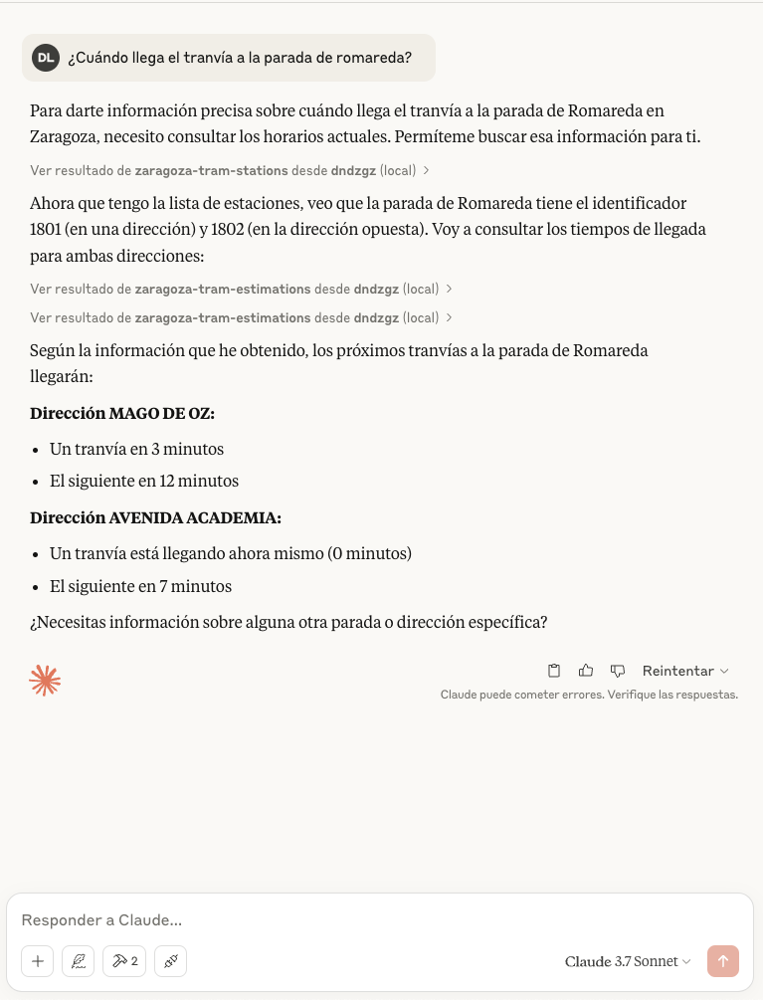

# DNDzgz MCP Server

This is an MCP (Model Context Protocol) server that provides information about the Zaragoza tram system, including real-time tram arrival estimations and station information using the [DNDzgz](https://www.dndzgz.com/) API.

## Installation

1. Clone the repository:
```bash
git clone https://github.com/danilat/mcp-dndzgz.git
cd mcp-dndzgz
```

2. Install dependencies:
```bash
npm install
```

## Running the Application

Add a the environment variable with a valid google maps api key
```bash
GOOGLE_MAPS_API_KEY=your-api-key
```

To start the server:
Configure in your MCP client using `npx`, for example:
```json
{
    "mcpServers": {
      "dndzgz": {
        "command": "npx @dndzgz/mcp",
        "env": {
          "GOOGLE_MAPS_API_KEY": "your-api-key"
        }
      }
    }
}
```

The server will start and connect to the MCP transport layer.

## Available Tools

The server provides the following tools:

1. `zaragoza-tram-estimations`: Get real-time arrival estimations for a specific tram station
   - Parameters: 
     - `station` (number): ID of the tram station
   - Returns: JSON with estimated arrival times for both directions

2. `zaragoza-tram-stations`: Get a list of all tram stations in Zaragoza
   - Parameters: 
     - `latitude` (number): Latitude to sort stations by proximity
     - `longitude` (number): Longitude to sort stations by proximity
   - Returns: JSON with station information including location, name, and ID

3. `zaragoza-bus-stops`: Get all bus stops in Zaragoza
   - Parameters: 
     - `latitude` (number): Latitude to sort stops by proximity
     - `longitude` (number): Longitude to sort stops by proximity
   - Returns: JSON with bus stop locations, names, IDs, and lines

4. `zaragoza-bus-estimations`: Get real-time arrival estimations for a specific bus stop
   - Parameters: 
     - `stop` (number): ID of the bus stop
   - Returns: JSON with estimated arrival times for each line serving that stop

5. `zaragoza-bizi-stations`: Get all Bizi stations in Zaragoza (public bicycle rental service)
   - Parameters: 
     - `latitude` (number): Latitude to sort stations by proximity
     - `longitude` (number): Longitude to sort stations by proximity
   - Returns: JSON with Bizi station locations, names, and IDs

6. `zaragoza-bizi-estimations`: Get real-time availability of bikes and free slots in a Bizi station
   - Parameters: 
     - `station` (number): ID of the Bizi station
   - Returns: JSON with bikes and parking slot availability

7. `google-maps-link`: Get a Google Maps link for a specific location
   - Parameters: 
     - `latitude` (number): Latitude of the location
     - `longitude` (number): Longitude of the location
   - Returns: Google Maps URL showing the specified location

8. `geolocation-from-address`: Get the geolocation (latitude and longitude) from an address and the formatted address that was found
   - Parameters:
     - `address` (string): The address to geolocate (e.g., "Plaza de San Francisco, Zaragoza, Spain")
   - Returns: JSON with latitude, longitude, confidence level, and formatted address

## Dependencies

- @modelcontextprotocol/sdk: ^1.9.0


## Example

There is an screenshot with example using Claude Desktop

